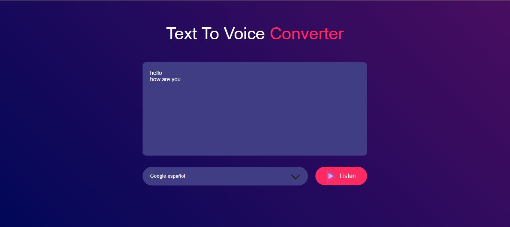

# text_to_speech_using_MS_speech_Synthesis
## GitHub Project Description for "Text-to-Speech Converter"

**Project Name:** Text-to-Speech Converter website interface

**Description:**  
The **Text-to-Speech Converter** is a lightweight and user-friendly web application that converts written text into spoken words using the browser's built-in speech synthesis capabilities. Users can enter any text, select a voice from the available options, and listen to the converted speech with a single click. 

### Features:
- **Responsive Design**: The application is visually appealing with a sleek and modern UI that adapts to various screen sizes.
- **Custom Voice Selection**: Choose from a variety of voices provided by the browser's speech synthesis API.
- **Simple Interaction**: Write text in the input area, click a button, and hear the spoken words.
- **Customization**: Modify styles, themes, and more via the CSS file provided.

### Tech Stack:
- **HTML5**: Markup for structuring the app's layout.
- **CSS3**: Styling for a vibrant and modern appearance.
- **JavaScript**: Core functionality powered by the SpeechSynthesis API.

### How to Run:
1. Clone the repository:
   ```bash
   git clone https://github.com/your-username/text-to-speech-converter.git
   ```
2. Open the `text-to-speech-converter.html` file in a modern web browser.
3. Type text into the textarea, select a voice from the dropdown, and click the "Listen" button to hear the text.

### Screenshots:
#### Interface Form


### Contribution:
Feel free to fork the repository and submit pull requests to enhance functionality, improve UI/UX, or fix bugs. Feedback is always welcome!
